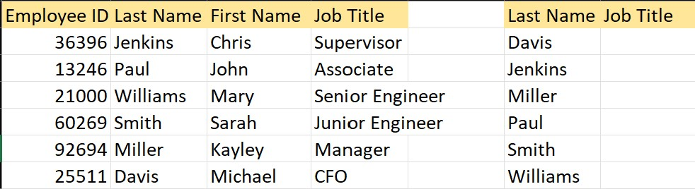
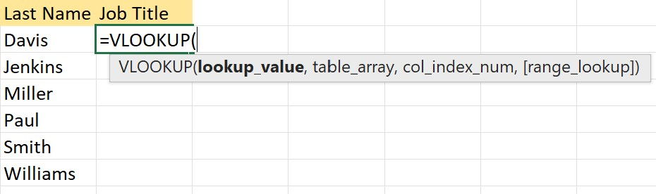
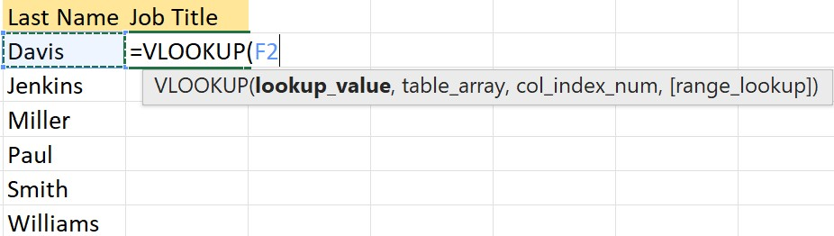
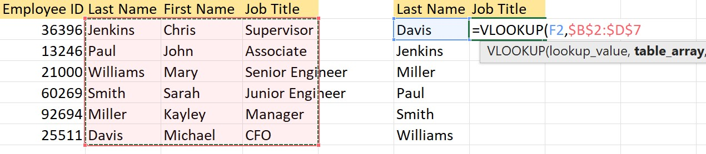
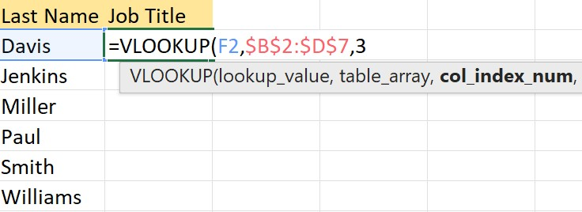
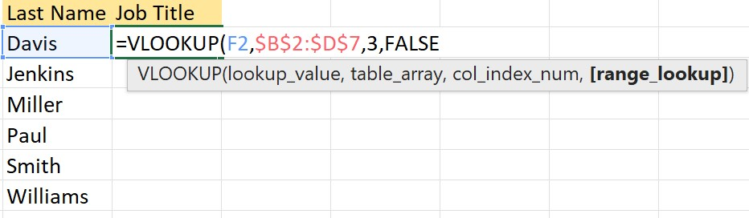
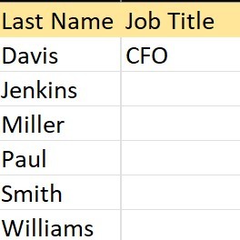
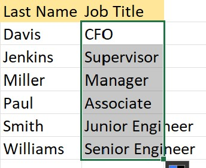

This is a basic tutorial on how to use the VLookup tool in Microsoft Excel with examples included for some useful situations.

## What is Vlookup?
VLookup stands for "vertical lookup" and is an excel tool that finds a match for a selected value within a different column of your table.
The formula for VLookup has 4 different parts, the lookup value, the table array, the column index number, and the approximate match.
We'll examine each part of the formula by itself before putting it all together.

## Why should you use VLookup
VLookup is useful as a tool when your dataset is large and you're looking for a match to a specific value. It's most useful when you have a large number of unique lookup values to search with. This is because you can autofill an entire column with useful data instead of having to manually search for each the corresponding values in the columns.

## Example Table

Let's use this table as our first example of something that we need filled out, and can use VLookup to great effect for. As you can see we have a table with data, and a second table with last names and an empty job titles column. VLookup will help us fill in this job titles column with matching data from our other table.

## The Lookup Value

The Lookup Value is a sort of reference value that you will use in order to search through your data. This value should be located in the leftmost column of your table, and if you plan on using approximate match, the column needs to be sorted numerically. In this case, We want to use last names to find Job titles so we choose the first last name in our lookup column.

## Table Array

The table array is the range of data that you want your data to look through. Your table array should contain all of the values that you might want as lookup values as well as the entire column that you want to search through.

If you want to quickly utilize VLookup using Excel's autofill feature, make sure that you make the table an absolute reference by pressing F4 when you highlight the table array, otherwise it will increment with the autofill and you may have errors. The dollar signs in the table array indicate that we have used absolute referencing so we will be fine.

## Column Index Number

The Column index Number is the column you want to search through and find the match for your lookup value. Columns are indexed at 1, starting from the first column of your table array. We want to find job titles which are 2 columns over from the last names column in the table array, so we put 3 as our column index number.

## Approximate Match

Optionally, you can decide if you want an approximate value or if you want an exact match. If you want an approximate, either use TRUE or leave blank, if you want an exact match, use FALSE. Most of the time you want to use FALSE in order to get the exact cell that matches the row of your lookup value.

We want an exact match of last name to job title, so we use FALSE.

## Putting it all together
So now we have the value we want to search with, our table array that we will look through, the index of the column that we want to search through, and we have decided if we want an approximate or exact match. 

Simply press enter and the function will return the value in the cell that is in the same row as our lookup value and the column that we indexed. 

Now we can use Excel's autofill feature to complete the rest of our table.

## Practice Data
image placeholder/link

That is all there is to using VLookup in Excel. Above is a QR code and link to an xlsx file with data that you can use to practice or play around with VLookup
